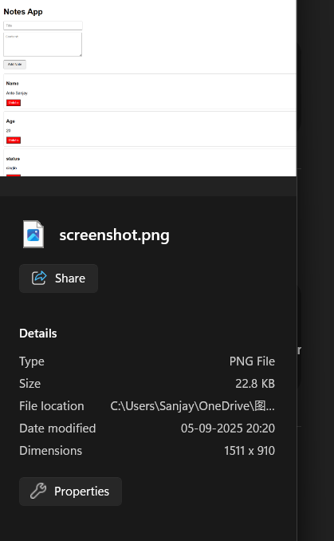

#  Notes App

A full-stack **Notes Application** with **FastAPI backend** and **React frontend**, deployed on **Render** (backend) and **Vercel** (frontend).  
Supports creating, viewing, and deleting notes.

---

#Live Demo- **Frontend**: [Notes Frontend](https://notes-frontend-h6scmr5pa-anto-codexs-projects.vercel.app/)  
- **Backend**: [Notes Backend](https://notes-backend-82qf.onrender.com/)

---

#Screenshot



---

# Features
- Add new notes with title & content
- View all notes in a clean UI
- Delete notes instantly
- RESTful API with FastAPI
- CORS enabled for frontend-backend communication

---

## 🛠Tech Stack
### Frontend
- React.js (Vite/CRA)
- Axios for API calls
- TailwindCSS (optional for styling)

### Backend
- FastAPI (Python)
- SQLite/PostgreSQL (configurable)
- SQLAlchemy ORM

### Deployment
- Backend → **Render**
- Frontend → **Vercel**

---

## ⚙️ Setup & Run Locally

### 1. Clone repositories
```bash
git clone https://github.com/Anto-codex/notes-backend.git
git clone https://github.com/Anto-codex/notes-frontend.git
  


2. Run Backend

cd notes-backend
python3 -m venv venv
source venv/bin/activate
pip install -r requirements.txt
uvicorn main:app --reload --host 127.0.0.1 --port 3001


Backend runs at → http://127.0.0.1:3001

3. Run Frontend

cd notes-frontend
npm install
npm start


Frontend runs at → http://localhost:3000

📡 API Endpoints
Method	Endpoint	Description
GET	/notes/	Get all notes
POST	/notes/	Create a new note
DELETE	/notes/{id}	Delete note by ID
🔐 DevOps & Monitoring

CI/CD pipeline with GitHub Actions

Dockerized backend (image pushed to DockerHub)

Monitoring setup with Prometheus + Grafana

Alerts for CPU & Memory usage

👨‍💻 Author

Anto Sanjay C
📧 antosanjay05@gmail.com

📞 +91 6382759693
🌍 GitHub
 | DockerHub

⭐ If you like this project, don’t forget to star the repo!


